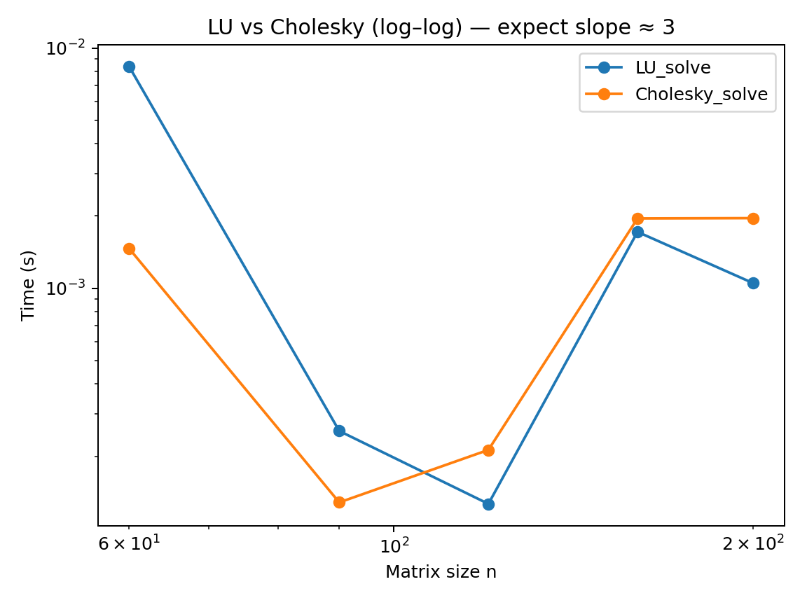
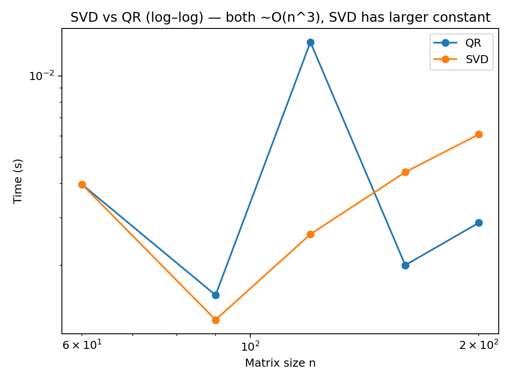
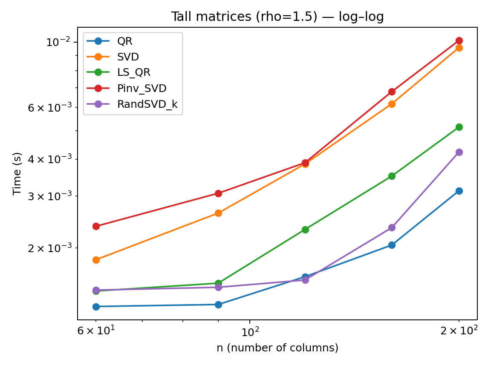
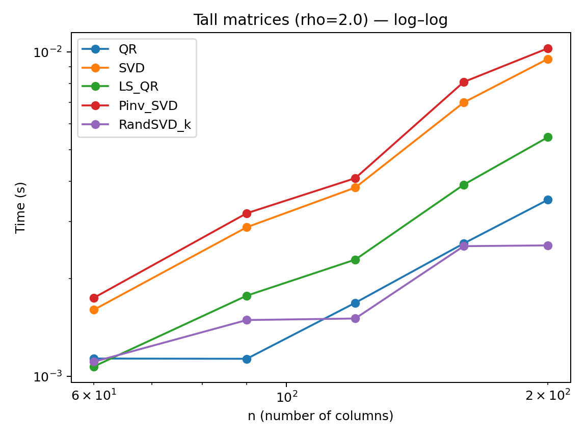
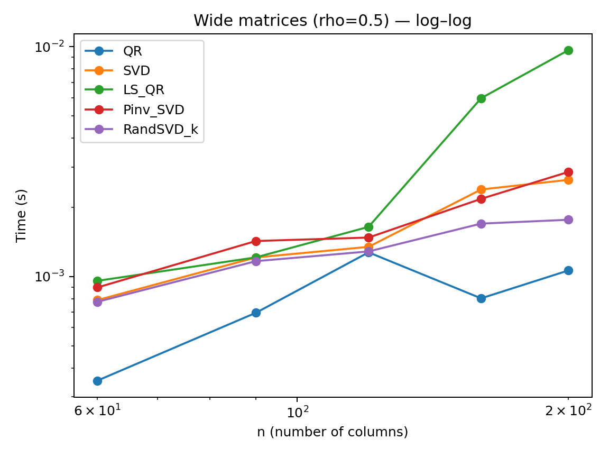

# Complexity Validation: Dense Factorizations & Solvers (Square/Tall/Wide)

A tiny, reproducible benchmark to **empirically validate complexity scaling**
for classic dense linear‐algebra routines under different matrix shapes:

- **Square**: LU solve, Cholesky solve (SPD), QR (Householder), economy SVD  
- **Tall/Wide**: QR, economy SVD, least squares (`lstsq`), pseudoinverse (`pinv`), **randomized truncated SVD(k)**

It fits runtime to a power law **t ≈ a · n^p** and plots log–log curves to show
the **expected slope ≈ 3** for classical dense algorithms, with **SVD having a larger constant**.

> If you use a task dimension model like `n = c · M` (with `M = 6 + m·a`),
> you can directly map the fitted exponent/results to your problem size.

---

## 🔧 Installation

- Python ≥ 3.9
- Only 3 dependencies:
  ```bash
  pip install -r requirements.txt

## 📊 Example Results

Below are sample plots generated by the benchmark (from `results/`):

### Square Matrices
- **LU vs Cholesky**


- **SVD vs QR**


### Tall Matrices (ρ = 1.5, 2.0)
- **ρ = 1.5**


- **ρ = 2.0**


### Wide Matrices (ρ = 0.5)
- **ρ = 0.5**
